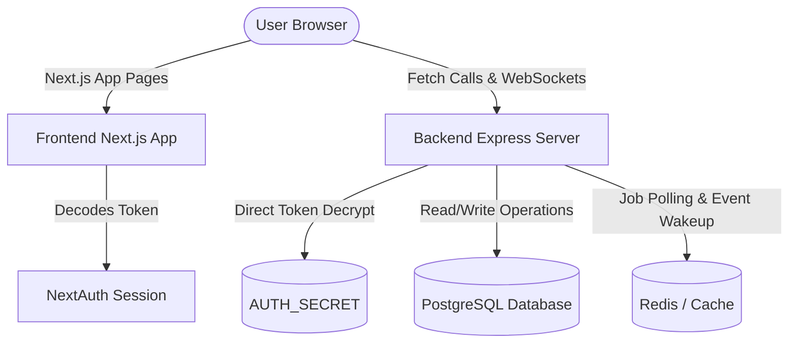

# Project Analysis: PREMA Engineering Intelligence Platform

This document presents the detailed architectural analysis of the current PREMA unified repository and outlines the target decoupled design.

## Current Configuration & Technologies

- **Framework**: Next.js (v16.2.9) utilizing App Router conventions.
- **Frontend Framework**: React (v19.2.4) with TailwindCSS (v4) for styling and Framer Motion for cinematic UI animations.
- **Backend Framework**: Next.js API Routes (serverless route handlers) inside `app/api/`.
- **Database**: PostgreSQL (Prisma ORM v6.19.3). Contains telemetry recording for slow queries and replica circuit breaker routing.
- **Authentication**: NextAuth.js / Auth.js (v5.0.0-beta.31) with Credentials (email/password via bcryptjs) and Google OAuth providers.
- **Environment Variables**:
  - `DATABASE_URL` / `DATABASE_REPLICA_URL` (connection strings)
  - `AUTH_SECRET` / `NEXTAUTH_URL` (authentication verification keys)
  - `RESEND_API_KEY` / `EMAIL_FROM` (email dispatch)
  - `S3_ACCESS_KEY` / `S3_SECRET_KEY` / `S3_BUCKET_NAME` / `S3_REGION` (file uploads)
  - `REDIS_URL` (caching & queue job wake-up)
- **Third-Party Services**:
  - Resend (Email transaction client)
  - AWS S3 (Presigned download/upload file management)
  - Redis (Memory cache store & event pub/sub trigger for the queue worker)
- **Static Assets**: Stored in `public/` (logos, certificates, 3D/GLTF configurations, design images).
- **Upload System**: Direct client-to-S3 uploads backed by database tracking records (`UploadedFile` model).
- **Package Manager**: npm (uses `package-lock.json`).
- **Build System**: Next.js build compiler and webpack tree-shaker.
- **Scripts**:
  - `npm run dev` (run local development server)
  - `npm run build` (build optimized production bundle)
  - `npm run lint` (run ESLint rules)
  - `npm test` (run mocked unit tests via tsx)

---

## Existing Architectural Problems

1. **Tight API/UI Coupling**: Next.js server-side route handlers share the same node context and resources as the presentation server. A spike in resource-heavy API tasks (e.g. AI Copilot processing or database replicas processing) can degrade frontend response time.
2. **Double Build Steps**: When deploying a unified codebase to platforms like Railway, both the frontend build and static compilation must run together on every container, making scaling difficult.
3. **Restricted Middleware Scope**: Next.js edge runtime middleware limits standard Node modules (like custom logger transports).

---

## Coupled Components to Untangle

- **Database Client**: `db/index.ts` initializes the Prisma client, sets up event listeners, and starts the background queue worker. This entire setup must belong solely to the backend.
- **Auth Configuration**: NextAuth JWT configurations must be shared via standard cookies. The frontend handles auth routes (login/register pages), and the Express backend decodes the session tokens to authorize API calls.
- **Background Worker Daemon**: Currently runs inside Next.js edge/node runtime. It will be moved entirely to the Express server startup process.

---

## Recommended Architecture

- **Frontend (`/frontend`)**: Dedicated Next.js 16 presentational shell. Pure client-side component code and Server Components for shell pages. Communicates with `/backend` using a defined `NEXT_PUBLIC_API_URL`.
- **Backend (`/backend`)**: Decoupled Express.js server on Node.js. Serves as the database interface, runs business domains (modules), hosts all security middlewares, and processes queue worker tasks.
