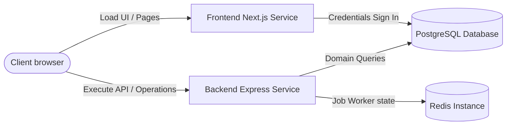

# Railway Deployment Configuration Guide

This document details the configuration for deploying the decoupled PREMA platform on Railway as two separate services (Frontend and Backend).

---

## Service 1: Frontend (Next.js App)

### Repository Configuration
- **Root Directory**: `frontend`
- **Build Command**: `npm run build`
- **Start Command**: `npm run start`

### Required Environment Variables
- `PORT`: Automatically set by Railway (usually `3000` or dynamic).
- `NEXT_PUBLIC_API_URL`: The production URL of the deployed Backend service.
- `AUTH_SECRET`: Static JWT decryption secret (e.g. generated via `openssl rand -base64 32`).
- `NEXTAUTH_URL`: The production URL of this Frontend service (for callback handling).
- `DATABASE_URL`: Connection string for PostgreSQL database.
- `GOOGLE_CLIENT_ID`: Optional Google Client ID.
- `GOOGLE_CLIENT_SECRET`: Optional Google Client Secret.
- `NEXT_PUBLIC_BASE_URL`: Base URL of this Frontend.

---

## Service 2: Backend (Express API Server)

### Repository Configuration
- **Root Directory**: `backend`
- **Build Command**: `npx prisma generate && npm run build`
- **Start Command**: `npm run start`

### Required Environment Variables
- `PORT`: Automatically injected by Railway.
- `DATABASE_URL`: Connection string to the primary PostgreSQL instance.
- `DATABASE_REPLICA_URL`: Optional connection string for read replica.
- `AUTH_SECRET`: MUST match the Frontend's `AUTH_SECRET` to decode session cookies successfully.
- `RESEND_API_KEY`: API key for transaction email client.
- `EMAIL_FROM`: Origin email address.
- `NOTIFICATION_RECEIVER_EMAIL`: Administrator notifications email.
- `REDIS_URL`: Reference to the Redis instance.
- `S3_ACCESS_KEY` / `S3_SECRET_KEY` / `S3_BUCKET_NAME` / `S3_REGION`: Object storage variables for file tracking.
- `ALLOWED_ORIGINS`: Comma-separated list of allowed CORS origins (must include the Frontend service URL).

---

## Database Setup & Prisma Migrations

Railway allows deploying a PostgreSQL database cluster alongside services. To boot the database:

1. **Deploy PostgreSQL**: Create a new PostgreSQL database service in your Railway project.
2. **Expose Connection String**: Expose the connection string as `DATABASE_URL` in both Frontend and Backend service configurations.
3. **Database Initialization**: Run the prisma commands to sync the database schema and populate it:
   ```bash
   # Execute inside the backend root
   npx prisma db push
   npx prisma db seed
   ```

---

## Recommended Deployment Topology


